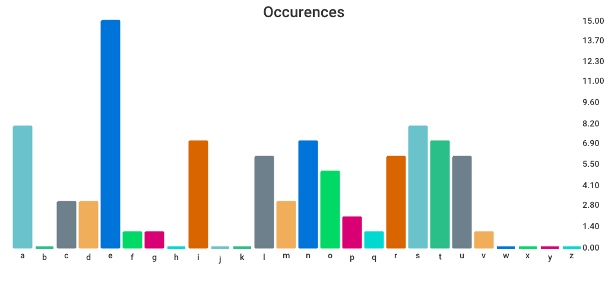

# char-stats


Generation of graphs according to the frequency of apparition of characters in a file. Can be used for cracking mono-alphabetical substitution encryption.

## Usage

```Shell
options :
	-file <folder name>
		file which will be analysed
	-output <graph name>
		name of the output graph (default: graph.png)
	-layout <layout type>
		alpha : alphabetical order (default)
		asc : ascending order
```
Typical use :
```Shell
$ go run main.go -file text.txt -output graph.png
```
This will analyse `text.txt` and display the results in a graph named `graph.png`. You have to specify the extension of the output (default : PNG).

## Example
Example with *La comédie humaine vol. 1* from Honoré de Balzac, in french :


## Copyright

License GPLv3+: GNU GPL version 3 or later <http://gnu.org/licenses/gpl.html>. This is free software: you are free to change and redistribute it.
